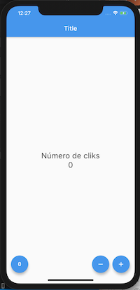

# proyect_init
Flutter App that change state on StatefulWidget

Applying the concepts:

* Scaffold
* AppBar
* Column
* Row
* FloatingActionButton
* SizedBox
* StatefulWidget
* StatelessWidget

## Screenshots

|  Screen      |
|------------|
|  |
